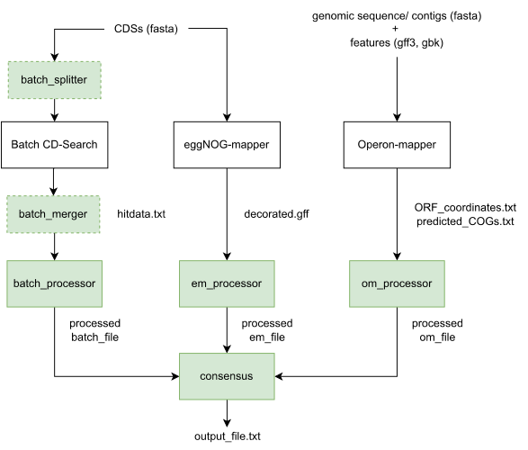
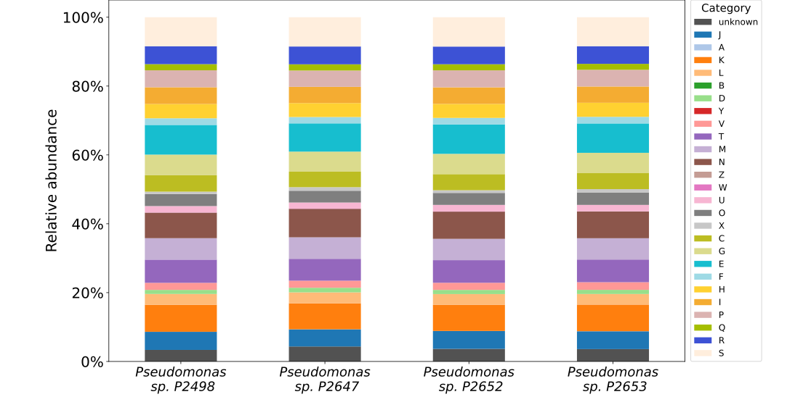

 # COGtools

## Introduction
COGtools is a package for improving the functional annotation of bacterial genomes, classification of 
protein-coding sequences into clusters of orthologous groups (COGs), and visualization of the final
annotated genome if a complete genome is available. The package uses the outputs of the tools that assign 
COGs to protein-coding sequences, namely eggNOG-mapper, Operon-mapper, and Batch CD-Search. The COGtools includes
functions to process these outputs and improve the annotation. It outputs a new processed file 
in a suitable format that is ready to be visualized in DNAPlotter program. In the case of draft genomes, 
a text file is generated with assigned cogs and their categories. When annotating multiple genomes, 
the COGtools offers the function to compare the relative abundance of categories in individual bacteria with barplots.

\
The tools for a genome annotation are available at:

eggNOG-mapper: http://eggnog-mapper.embl.de/

Operon-mapper: https://biocomputo.ibt.unam.mx/operon_mapper/

Batch CD-Search: https://www.ncbi.nlm.nih.gov/Structure/bwrpsb/bwrpsb.cgi

## Installation 
You can download COGtools with:

```
git clone https://github.com/xpolak37/COGtools
```

## Usage

The COGtools consists of 13 functions (see diagram below). You can use them separately or you can run the whole process via the command line. 
Please, refer to a COGtools documentation with tutorials attached.


## Possible results
Using COGtools with a DNAPlotter program you can obtain similar image as the one shown as an example below.


If you have annotated multiple genomes using COGtools, 
you can visualize the relative abundance of COG categories in the given genomes using barplots (see example below).



